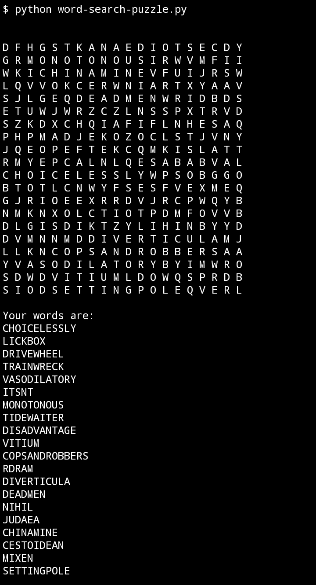
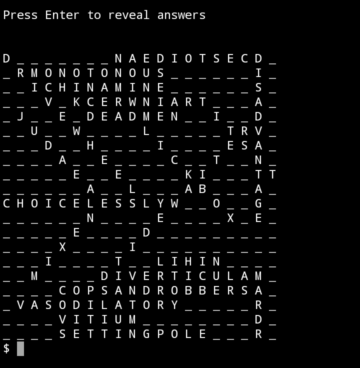

# Word Search Puzzle Generator
### by KenesuEXE

A word search puzzle generator in Python   
Part of KenesuEXE's WPC (Weekend Project Collection)   
WPC #1 May 22-24, 2021

## Usage
Run the `word_search_puzzle.py` script to generate a random word search puzzle.

## Importing create_puzzle()
You can choose your own words by importing the function create_puzzle(word_list, grid_size).   
The function returns a tuple that contains the puzzle grid, and an unfilled grid (to reveal answer). 
To print the grid, do:
```
for row in grid:
    print(' '.join(row))
```

## Requirements
When importing the create_puzzle() function, no additional libraries are required.   
When using the script and the pick_random_words(), the module Random-Word is required.
```
pip install Random-Word
```

## Images 
(Yes, this too was made on an Android.)


