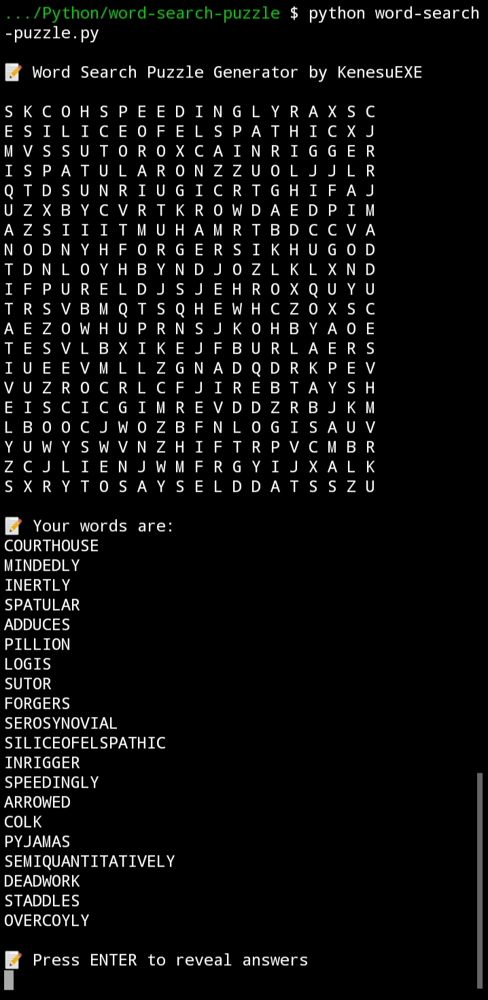

# Word Search Puzzle Generator
### by KenesuEXE

A word search puzzle generator in Python   

## Usage
Run the `word_search_puzzle.py` script to generate a random word search puzzle.
You can also input your own grid size, word count, and word maxlength by using `python word_search_puzzle.py -h`

## Pick your own words
You can choose your own words by using the `create_puzzle(grid_size, word_list)` function. 
`grid_size` is an integer indicating the size of the puzzle grid and `word_list` is a list of your chosen words.
The function returns a dictionary with two elements `filled_grid` and `revealed_grid`, both are nested lists.
To print the grid to your console, do:
```
for row in grid:
    print(' '.join(row))
```


## Images 

Actual Generated Puzzle (see if you can find all)


Puzzle Answers Revealed

